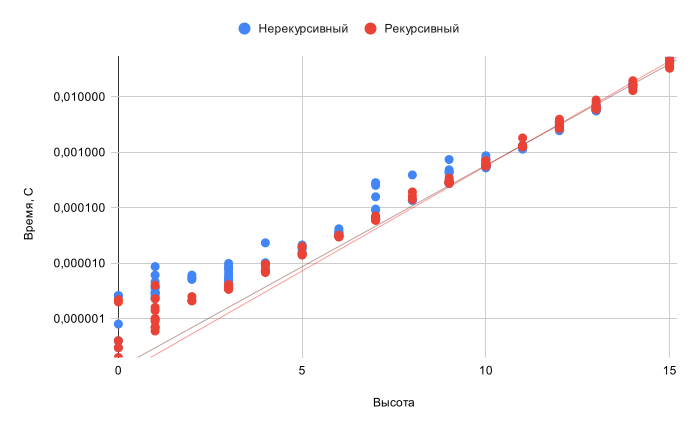

# Лабораторная работа 3: Сравнение рекурсивного и нерекурсивного алгоритмов для построения бинарного дерева
> Автор: *Иванов Никита Русланович*

### Цель работы:
Реализовать и сравнить два метода построения бинарных деревьев:

1. Рекурсивный алгоритм для построения бинарного дерева.
2. Нерекурсивный алгоритм для построения бинарного дерева.

Использовать эти методы для генерации бинарных деревьев с заданными параметрами и провести их сравнение по времени работы.

## Описание решения:
# Время вычисления функции построения бинарного дерева
## Параметры измерений

### Измерение №1
С помощью модуля `timeit`  производилось 5 повторных запусков функции с 1 миллионом итераций каждый.  

Пример запуска: python -m timeit -r 5 -n 1000000 -s 'from tree import gen_bin_tree' -u 'msec' 'gen_bin_tree'
- Значение корня: 5
- Высота дерева: 10
- Функция для левого потомка: `left_l_func = root + 2`
- Функция для правого потомка: `right_l_func = root * 3`
  
 Ниже приведены лучшие результаты измерений в миллисекундах для каждого алгоритма: 

 - Результат нерекурсивного алгоритма  
1000000 loops, best of 5: 0.0146 msec per loop

- Результат рекурсивного алгоритма  
1000000 loops, best of 5: 0.0142 msec per loop

### Измерение №2

- Значение корня: от 0 до 15 (случайным образом)
- Высота дерева: от 0 до 100 (случайным образом)
- Функция для левого потомка: `left_l_func = root + 2`
- Функция для правого потомка: `right_l_func = root * 3`

#### Результаты измерений
Значение корня имеет очень малое влияние на время работы функций, но при этом он задается случайно, чтобы избежать случайного хеширования.

При получении и анализе данных было принято решение построить график зависимости времени построения функции(Y) от высоты дерева(X) в логарифмическом масштабе

Можно заметить, что время работы обоих алгоритмов возрастает экспоненциально с увеличением высоты дерева. Рекурсивный алгоритм оказывается быстрее нерекурсивного на меньших высотах, а нерекурсивный - на высоких. Однако для более детального анализа необходимо провести больше измерений, что не было возможно сделать в рамках данного исследования из-за небольших вычислительных мощностей используемой машины.