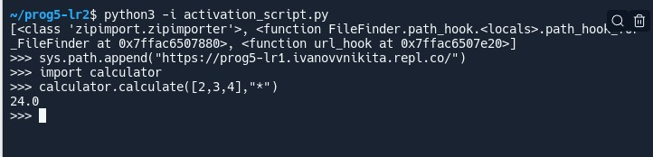

# Лабораторная работа 2

Выполнил: _Иванов Никита Русланович_

Описание ЛР:

Реализация удаленного импорта
- Результат с внутренним модулем `myremotemodule`

- Результат с внешним модулем `calculator` из ЛР 1

- url_hook переделан с использованием `request`