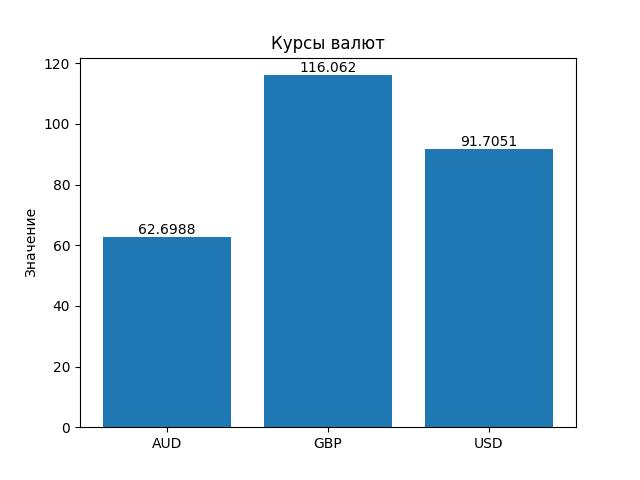

# Лабораторная работа №5: Создание приложения для получения курса валют.
> Автор: *Иванов Никита Русланович*

### Цель работы:
Целью данной лабораторной работы является создание класса для работы с курсами валют, получения данных с сайта Центрального Банка России и их визуализация.

## Описание решения:

### 1. Класс `CurrenciesLst`
Класс `CurrenciesLst` предназначен для работы с курсами валют. Он реализует несколько методов для получения информации о валютах, а также для их визуализации. В этом классе присутствуют следующие методы:

- **`get_currencies()`** — получает курсы валют с сайта Центрального Банка России, парсит XML и сохраняет данные в объекте.
- **`__get_valute(id: str)`** — возвращает информацию о валюте по ее идентификатору.
- **`__getitem__(id)`** — переопределенный метод для получения информации о валюте по ее идентификатору с использованием оператора индексации.
- **`select_valute(id: str)`** — выбирает валюту для отслеживания.
- **`get_currencies_ids_lst()`** — возвращает список идентификаторов отслеживаемых валют.
- **`get_last_update()`** — возвращает время последнего обновления данных о валютах.
- **`visualize_currencies()`** — визуализирует курсы валют и сохраняет график в файл `currencies.jpg`.

### 2. Визуализация данных
После выполнения программы будет сохранен график курсов валют в файл `currencies.jpg`. Этот график визуализирует курсы валют и помогает наглядно представить данные. Для этого используется библиотека `matplotlib`, которая строит столбчатую диаграмму, где на оси X расположены символы валют, а на оси Y — их значения.

```python
import matplotlib.pyplot as plt

fig, ax = plt.subplots()
currencies = []
values = []

for curr in self.__cur_lst:
    for c, v in curr.items():
        currencies.append(c)
        values.append(v[1])

bars = ax.bar(currencies, values)
ax.bar_label(bars)
ax.set_ylabel('Значение') 
ax.set_title('Курсы валют')

plt.savefig('currencies.jpg')
```


### 3. Результат работы

