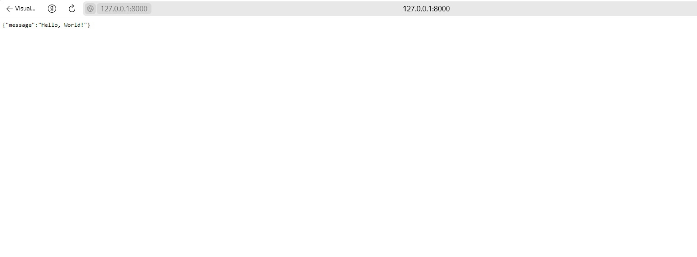

# Лабораторная работа №3: Развертывание приложения на FastAPI с использованием виртуального окружения
> Автор: *Иванов Никита*

## Шаг 1: Установка и активация виртуального окружения
Установите virtualenv, если он еще не установлен, с помощью команды:

`pip install virtualenv`

Создайте виртуальное окружение, перейдя в директорию вашего проекта, и выполните команду:

`virtualenv venv`

На Windows:

`venv\Scripts\activate`

## Шаг 2: Установка необходимых зависимостей
Установите FastAPI с помощью команды:

`pip install fastapi `

## Шаг 3: Запуск сервера FastAPI
В вашем коде FastAPI запустите сервер с помощью команды:
python

`from fastapi import FastAPI`

app = FastAPI()

`uvicorn main:app --reload`

После запуска сервера вы увидите сообщение о том, что сервер работает и указание на URL-адрес сервера, например: http://127.0.0.1:8000.

Развертываемый код представлен в файле **main.py** результат развертывания представлен ниже:

